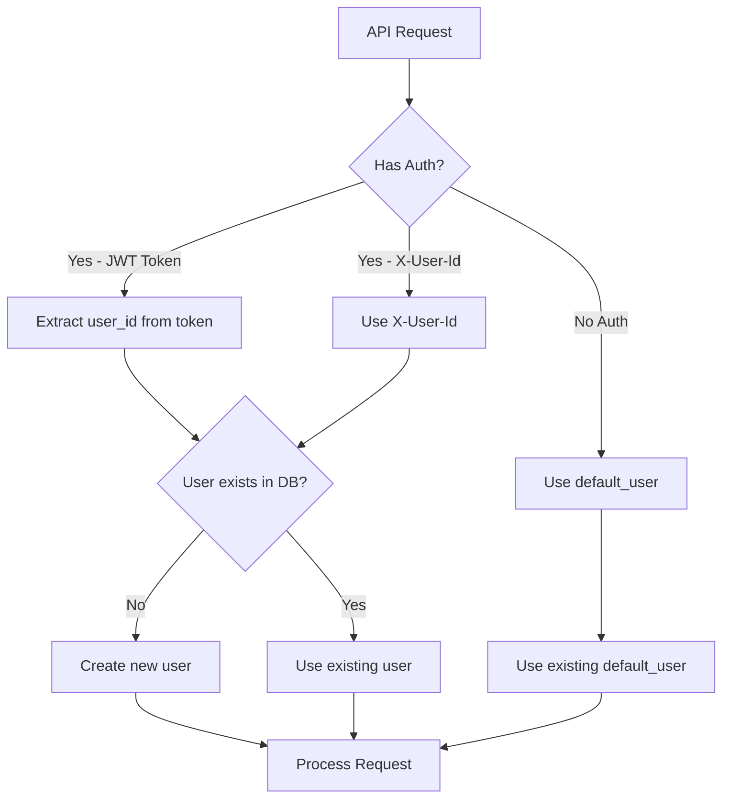

# User Creation System - Explanation

## 📊 Current Status

### ✅ Users in Database:
```
1. default_user (ID: a0000000-0000-0000-0000-000000000001)
   - Created: Jan 6, 2026
   - Display Name: Default User (Migration)
   - Purpose: Fallback user when no authentication provided

2. 76aa71b0-8aae-48b4-9458-64dd75c9f630
   - Created: Jan 7, 2026 (10:14:22 AM)
   - Display Name: 76aa71b0-8aae-48b4-9458-64dd75c9f630
   - Purpose: Real user created via /auth/token endpoint
```

---

## 🔍 Why It Uses `default_user`

### **The Issue:**

From the logs, I found this line:
```
2026-01-07 10:14:22,339 - app.core.auth - DEBUG - Authentication disabled - no X-User-Id provided, using default user
```

### **What's Happening:**

1. **When you don't provide authentication**, the system falls back to `default_user`
2. **This is by design** for backward compatibility and development
3. **All unauthenticated requests** use the same `default_user` account

---

## ✅ How User Creation DOES Work

### **Method 1: Via Token Endpoint (Correct Way)**

```bash
# Create a JWT token (this creates the user)
curl -X POST http://localhost:8000/auth/token \
  -H "Content-Type: application/json" \
  -d '{
    "user_id": "alice",
    "expires_in_hours": 24
  }'

# Use the token in your requests
curl -X POST http://localhost:8000/chat \
  -H "Authorization: Bearer <your_token>" \
  -H "Content-Type: application/json" \
  -d '{"message": "Hello!"}'
```

**Result:** ✅ New user "alice" created automatically

---

### **Method 2: Via X-User-Id Header (Dev Only)**

```bash
curl -X POST http://localhost:8000/chat \
  -H "X-User-Id: bob" \
  -H "Content-Type: application/json" \
  -d '{"message": "Hello!"}'
```

**Result:** ✅ New user "bob" created automatically

---

### **Method 3: No Authentication (Uses Default)**

```bash
curl -X POST http://localhost:8000/chat \
  -H "Content-Type: application/json" \
  -d '{"message": "Hello!"}'
```

**Result:** ⚠️  Uses `default_user` (no new user created)

---

## 🔧 From Your Logs

Looking at your most recent request (10:14:22 AM):

```log
# 1. Token created successfully
app.core.auth - INFO - Created new user: 76aa71b0-8aae-48b4-9458-64dd75c9f630

# 2. But then... no authentication provided in next request
app.core.auth - DEBUG - Authentication disabled - no X-User-Id provided, using default user

# 3. Chat request uses default_user instead
app.api.routes - INFO - Chat request: user=default_user, conversation_id=None
```

---

## 📋 How to Fix

### **Option 1: Always Use JWT Tokens (Recommended)**

```typescript
// 1. Get token
const tokenResponse = await fetch('http://localhost:8000/auth/token', {
  method: 'POST',
  headers: {'Content-Type': 'application/json'},
  body: JSON.stringify({
    user_id: 'your-unique-user-id',
    expires_in_hours: 24
  })
});

const {access_token} = await tokenResponse.json();

// 2. Use token in all requests
const chatResponse = await fetch('http://localhost:8000/chat', {
  method: 'POST',
  headers: {
    'Authorization': `Bearer ${access_token}`,
    'Content-Type': 'application/json'
  },
  body: JSON.stringify({
    message: 'Hello!'
  })
});
```

---

### **Option 2: Use X-User-Id Header (Development)**

```typescript
const response = await fetch('http://localhost:8000/chat', {
  method: 'POST',
  headers: {
    'X-User-Id': 'your-unique-user-id',
    'Content-Type': 'application/json'
  },
  body: JSON.stringify({
    message: 'Hello!'
  })
});
```

---

## 🎯 User Creation Flow



---

## 🔍 Verification Commands

### Check all users:
```bash
docker exec ai_companion_db_dev psql -U postgres -d ai_companion \
  -c "SELECT id, external_user_id, display_name, created_at FROM users ORDER BY created_at DESC;"
```

### Check conversations by user:
```bash
docker exec ai_companion_db_dev psql -U postgres -d ai_companion \
  -c "SELECT c.id, u.external_user_id, c.created_at FROM conversations c JOIN users u ON c.user_id = u.id ORDER BY c.created_at DESC LIMIT 10;"
```

### Check memories by user:
```bash
docker exec ai_companion_db_dev psql -U postgres -d ai_companion \
  -c "SELECT m.id, u.external_user_id, m.content, m.created_at FROM memories m JOIN users u ON m.user_id = u.id ORDER BY m.created_at DESC LIMIT 10;"
```

---

## ⚙️ Configuration

In your `.env` file:

```bash
# Set to 'false' in production to disable default_user fallback
REQUIRE_AUTHENTICATION=true

# Set to 'false' in production to prevent X-User-Id spoofing
ALLOW_X_USER_ID_AUTH=true
```

---

## 📊 Summary

**Issue:** Requests without authentication use `default_user`

**Solution:** Always provide authentication:
- ✅ **Production:** Use JWT tokens via `/auth/token`
- ✅ **Development:** Use `X-User-Id` header
- ❌ **Don't:** Make requests without authentication

**User Creation:** ✅ Working correctly! Users are created when:
1. You call `/auth/token` with a new `user_id`
2. You use `X-User-Id` header with a new ID
3. They DON'T exist in the database yet

---

## 🎯 Next Steps for Your Angular App

```typescript
import { Injectable } from '@angular/core';

@Injectable({providedIn: 'root'})
export class AuthService {
  private token: string | null = null;
  private userId: string = '';

  async login(userId: string) {
    // Create token
    const response = await fetch('http://localhost:8000/auth/token', {
      method: 'POST',
      headers: {'Content-Type': 'application/json'},
      body: JSON.stringify({user_id: userId, expires_in_hours: 24})
    });
    
    const data = await response.json();
    this.token = data.access_token;
    this.userId = userId;
    
    // Store in localStorage
    localStorage.setItem('ai_token', this.token);
    localStorage.setItem('ai_user_id', this.userId);
  }

  getAuthHeaders() {
    return {
      'Authorization': `Bearer ${this.token}`,
      'Content-Type': 'application/json'
    };
  }
}
```

---

**Created:** Jan 7, 2026  
**Service Version:** 4.0.0

